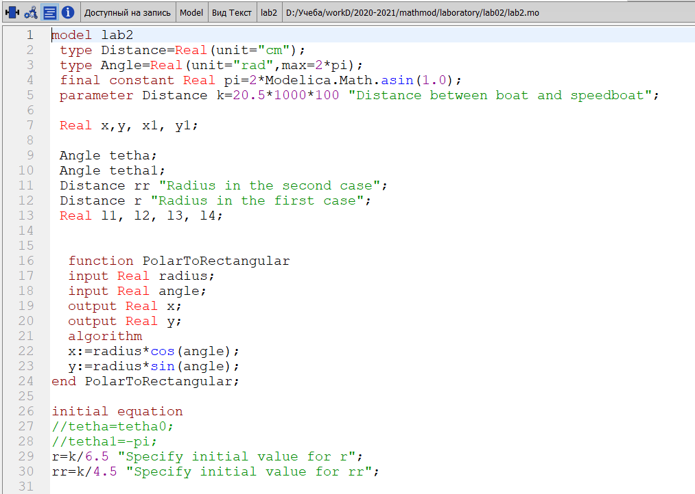
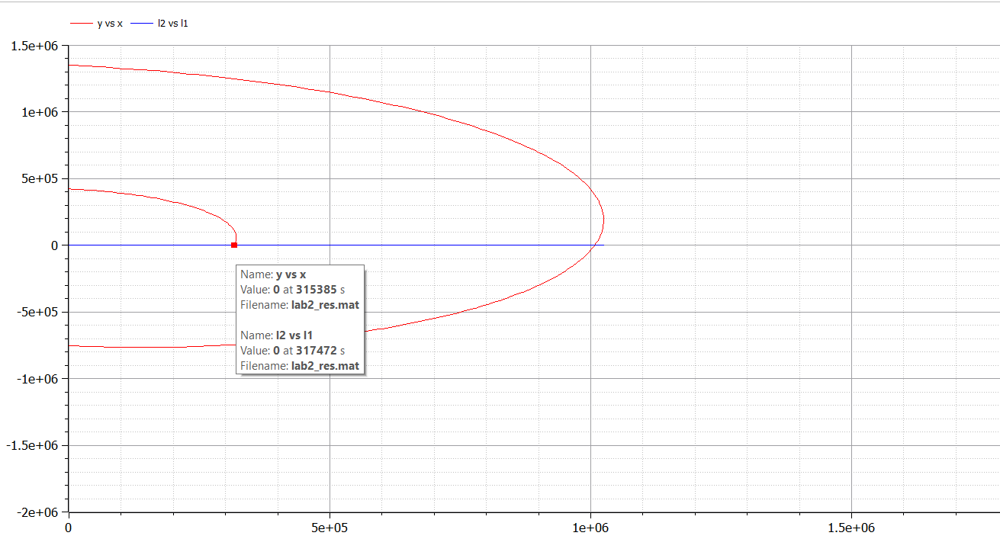
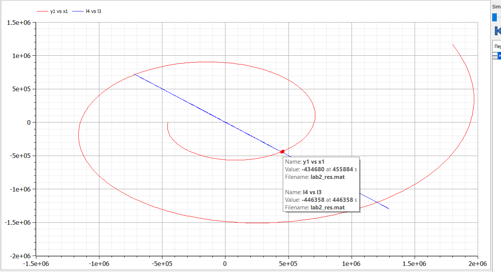

---
# Front matter
lang: ru-RU
title: "Отчет по лабораторной работе №2"
subtitle: "Дисциплина: Математическое моделирование"
author: "Выполнила Дяченко Злата Константиновна, НФИбд-03-18"

# Formatting
toc-title: "Содержание"
toc: true # Table of contents
toc_depth: 2
lof: true # List of figures
lot: true # List of tables
fontsize: 12pt
linestretch: 1.5
papersize: a4paper
documentclass: scrreprt
polyglossia-lang: russian
polyglossia-otherlangs: english
mainfont: PT Serif
romanfont: PT Serif
sansfont: PT Sans
monofont: PT Mono
mainfontoptions: Ligatures=TeX
romanfontoptions: Ligatures=TeX
sansfontoptions: Ligatures=TeX,Scale=MatchLowercase
monofontoptions: Scale=MatchLowercase
indent: true
pdf-engine: lualatex
header-includes:
  - \linepenalty=10 # the penalty added to the badness of each line within a paragraph (no associated penalty node) Increasing the value makes tex try to have fewer lines in the paragraph.
  - \interlinepenalty=0 # value of the penalty (node) added after each line of a paragraph.
  - \hyphenpenalty=50 # the penalty for line breaking at an automatically inserted hyphen
  - \exhyphenpenalty=50 # the penalty for line breaking at an explicit hyphen
  - \binoppenalty=700 # the penalty for breaking a line at a binary operator
  - \relpenalty=500 # the penalty for breaking a line at a relation
  - \clubpenalty=150 # extra penalty for breaking after first line of a paragraph
  - \widowpenalty=150 # extra penalty for breaking before last line of a paragraph
  - \displaywidowpenalty=50 # extra penalty for breaking before last line before a display math
  - \brokenpenalty=100 # extra penalty for page breaking after a hyphenated line
  - \predisplaypenalty=10000 # penalty for breaking before a display
  - \postdisplaypenalty=0 # penalty for breaking after a display
  - \floatingpenalty = 20000 # penalty for splitting an insertion (can only be split footnote in standard LaTeX)
  - \raggedbottom # or \flushbottom
  - \usepackage{float} # keep figures where there are in the text
  - \floatplacement{figure}{H} # keep figures where there are in the text
---
# Цель работы

Построить математическую модель для выбора правильной стратегии при решении задачи о погоне.

# Задание

- Провести рассуждения и вывод дифференциальных уравнений, если скорость катера больше скорости лодки в 5.5 раз.
- Построить траекторию движения катера и лодки для двух случаев.
- Определить по графику точку пересечения катера и лодки.

# Объект и предмет исследования

Объектом исследования в данной лабораторной работе является задача о погоне, а предметом исследования - траектории движения лодки и катера при определенных начальных условиях.

# Теоретические вводные данные

## Постановка задачи

На море в тумане катер береговой охраны преследует лодку браконьеров. Через определенный промежуток времени туман рассеивается, и лодка обнаруживается на расстоянии k км от катера. Затем лодка снова скрывается в тумане и уходит прямолинейно в неизвестном направлении. Известно, что скорость катера в 2 раза больше скорости лодки.

Принимаем за $t_{0} = 0$, $x_{0} = 0$  - место нахождения лодки браконьеров в момент обнаружения, $x_{к0} = k$ - место нахождения катера береговой охраны относительно лодки браконьеров в момент обнаружения лодки.

Введем полярные координаты. Считаем, что полюс - это точка обнаружения лодки браконьеров  $x_{л0} = 0$, а полярная ось r проходит через точку нахождения катера береговой охраны.

Траектория катера должна быть такой, чтобы и катер, и лодка все время
были на одном расстоянии от полюса $\theta$, только в этом случае траектория
катера пересечется с траекторией лодки. Поэтому для начала катер береговой охраны должен двигаться некоторое время прямолинейно, пока не окажется на том же расстоянии от полюса, что и лодка браконьеров. После этого катер береговой охраны должен двигаться вокруг полюса удаляясь от него с той же скоростью, что и лодка браконьеров.

Расстояние, после которого катер начнет двигаться вокруг полюса может быть найден двумя способами в зависимости от начального положения катера относительно полюса. Назовем это расстояние x.

Решение задачи сводится к решению уравнения $\frac{dr}{d\theta} = \frac{r}{\sqrt{3}}$ с начальными условиями
$\begin{cases}
    \theta_{0} = 0 \\
    r_{0}=x_{1}
  \end{cases}$
или $\begin{cases}
    \theta_{0} = -\pi \\
    r_{0}=x_{2}
  \end{cases}$

# Выполнение лабораторной работы

## Шаг 1

Я высчитала, что мой вариант 61. В данном варианте начальное расстрояние от лодки до катера 20,5 км, а скорость катера в 5,5 раз больше скорости лодки. Учитывая эти данные, я произвела вывод необходимых для решения задачи дифференциальных уравнений. Получилось, что $\frac{dr}{d\theta} = \frac{r}{\sqrt{29.25}}$, где первый случай начальных условий
$\begin{cases}
    \theta_{0} = 0 \\
    r_{0}=\frac{k}{6.5}
  \end{cases}$
, а второй случай

$\begin{cases}
    \theta_{0} = -\pi \\
    r_{0}=\frac{k}{4.5}
  \end{cases}$
(рис. -@fig:001)

{#fig:001 width=70%}

## Шаг 2

Построила модель в Modelica (рис. -@fig:004)

{#fig:004 width=70%}

(рис. -@fig:005)

{#fig:005 width=70%}

## Шаг 3

Построила траекторию движения катера и лодки для двух случаев (рис. -@fig:002)

{#fig:002 width=70%}

 (рис. -@fig:003)

{#fig:003 width=70%}

По графику определила точки пересечения траекторий.

# Выводы

Я построила математическую модель для решения задачи о погоне. Результаты работы находятся в [репозитории на GitHub] (https://github.com/ZlataDyachenko/workD), а также есть [скринкаст выполнения лабораторной работы] (https://youtu.be/9tQHPaN8gdQ).
