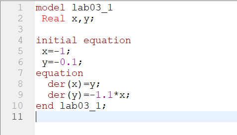
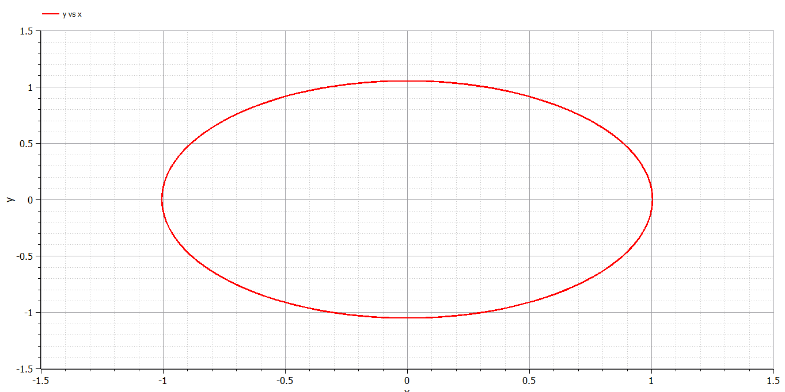
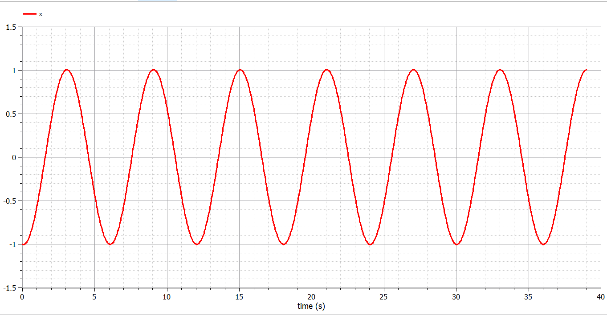
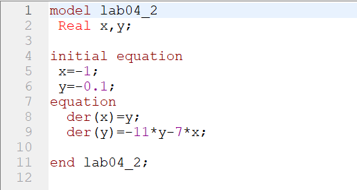
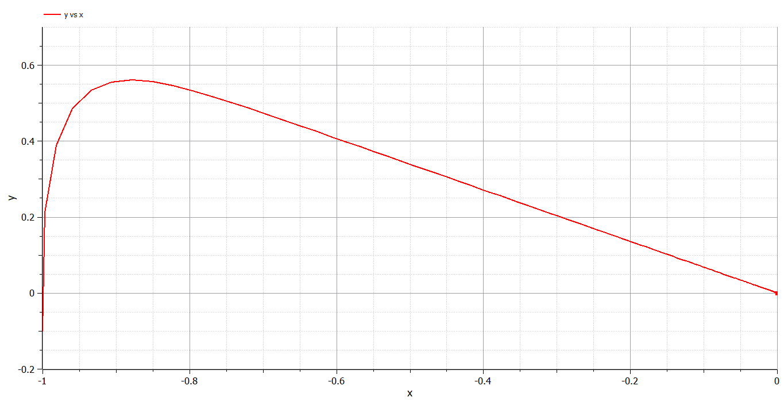
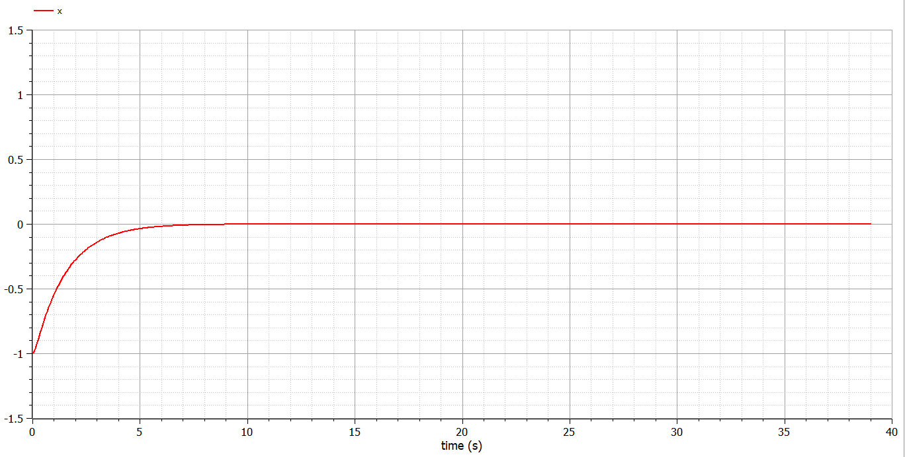
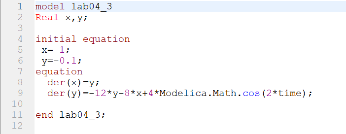
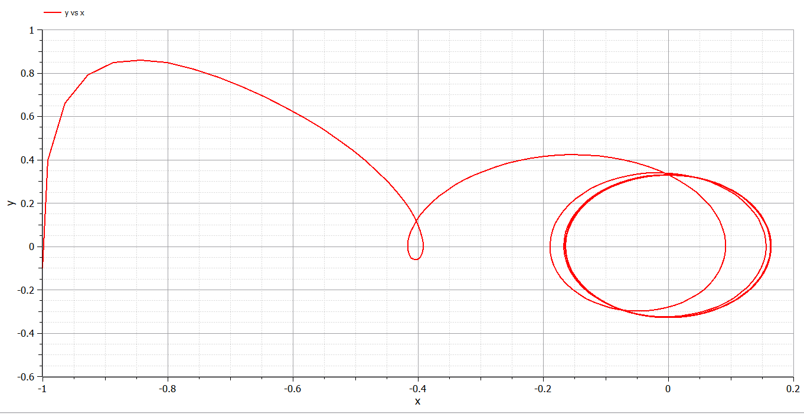
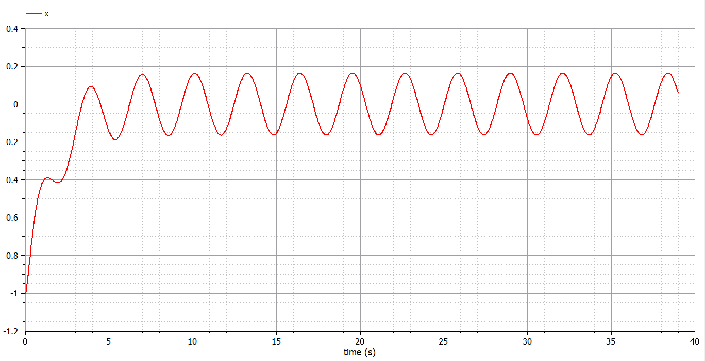

---
# Front matter
lang: ru-RU
title: "Отчет по лабораторной работе №4"
subtitle: "Дисциплина: Математическое моделирование"
author: "Выполнила Дяченко Злата Константиновна, НФИбд-03-18"
teacher: "Преподаватель: Кулябов Дмитрий Сергеевич"

# Formatting
toc-title: "Содержание"
toc: true # Table of contents
toc_depth: 2
lof: true # List of figures
lot: true # List of tables
fontsize: 12pt
linestretch: 1.5
papersize: a4paper
documentclass: scrreprt
polyglossia-lang: russian
polyglossia-otherlangs: english
mainfont: PT Serif
romanfont: PT Serif
sansfont: PT Sans
monofont: PT Mono
mainfontoptions: Ligatures=TeX
romanfontoptions: Ligatures=TeX
sansfontoptions: Ligatures=TeX,Scale=MatchLowercase
monofontoptions: Scale=MatchLowercase
indent: true
pdf-engine: lualatex
header-includes:
  - \linepenalty=10 # the penalty added to the badness of each line within a paragraph (no associated penalty node) Increasing the value makes tex try to have fewer lines in the paragraph.
  - \interlinepenalty=0 # value of the penalty (node) added after each line of a paragraph.
  - \hyphenpenalty=50 # the penalty for line breaking at an automatically inserted hyphen
  - \exhyphenpenalty=50 # the penalty for line breaking at an explicit hyphen
  - \binoppenalty=700 # the penalty for breaking a line at a binary operator
  - \relpenalty=500 # the penalty for breaking a line at a relation
  - \clubpenalty=150 # extra penalty for breaking after first line of a paragraph
  - \widowpenalty=150 # extra penalty for breaking before last line of a paragraph
  - \displaywidowpenalty=50 # extra penalty for breaking before last line before a display math
  - \brokenpenalty=100 # extra penalty for page breaking after a hyphenated line
  - \predisplaypenalty=10000 # penalty for breaking before a display
  - \postdisplaypenalty=0 # penalty for breaking after a display
  - \floatingpenalty = 20000 # penalty for splitting an insertion (can only be split footnote in standard LaTeX)
  - \raggedbottom # or \flushbottom
  - \usepackage{float} # keep figures where there are in the text
  - \floatplacement{figure}{H} # keep figures where there are in the text
---
# Цель работы

Изучить и построить математическую модель гармонических колебаний - линейный гармонический осциллятор.

# Задание

Построить фазовый портрет гармонического осциллятора и решение уравнения гармонического осциллятора для следующих случаев:  
1. Колебания гармонического осциллятора без затуханий и без действий внешней силы $\ddot{x}+1.1x = 0$  
2. Колебания гармонического осциллятора с затуханием и без действий внешней силы $\ddot{x}+11\dot{x}+7x = 0$  
3. Колебания гармонического осциллятора с затуханием и под действием внешней силы  $\ddot{x}+12\dot{x}+8x = 4\cos(2t)$  

# Объект и предмет исследования

Объектом исследования в данной лабораторной работе является линейный гармонический осциллятор, а предметом исследования - фазовый портрет и решение уравнения осциллятора для конкретных случаев.

# Теоретические вводные данные

Движение грузика на пружинке, маятника, заряда в электрическом контуре, а также эволюция во времени многих систем в физике, химии, биологии и других науках при определенных предположениях можно описать одним и тем же дифференциальным уравнением, которое в теории колебаний выступает в качестве основной модели. Эта модель называется линейным гармоническим осциллятором.

Уравнение свободных колебаний гармонического осциллятора имеет следующий вид:
 $$\ddot{x}+2\gamma\dot{x}+\omega_{0}^{2}x = 0$$
 где $x$ – переменная, описывающая состояние системы (смещение грузика, заряд конденсатора и т.д.), $\gamma$ – параметр, характеризующий потери энергии (трение в механической системе, сопротивление в контуре), $\omega_{0}$ – собственная частота колебаний.
 При отсутствии потерь в системе ($\gamma =0$) получаем уравнение консервативного осциллятора энергия колебания которого сохраняется во времени.
 $$\ddot{x}+\omega_{0}^{2}x = 0$$
 Данное уравнение второго порядка можно представить в виде системы двух уравнений первого порядка:

 $$\begin{cases}
     \dot{x} = y \\
     \dot{y}=-\omega_{0}^{2}x
   \end{cases}$$

Начальные условия для системы примут вид:
$$\begin{cases}
    x(t_{0})=x_0 \\
    y(t_{0})=y_0
  \end{cases}$$

Независимые переменные $x$, $y$ определяют пространство, в котором «движется» решение. Это фазовое пространство системы, поскольку оно двумерно будем называть его фазовой плоскостью. Значение фазовых координат $x$, $y$ в любой момент времени полностью определяет состояние системы. Решению уравнения движения как функции времени отвечает гладкая кривая в фазовой плоскости. Она называется фазовой траекторией. Если множество различных решений (соответствующих различным начальным условиям) изобразить на одной фазовой плоскости, возникает общая картина поведения системы. Такую картину, образованную набором фазовых траекторий, называют фазовым портретом.

# Выполнение лабораторной работы

## Шаг 1

Я построила модель колебаний гармонического осциллятора без затуханий и без действий внешней силы $\ddot{x}+1.1x = 0$ с начальными условиями $x_0=-1, y_0=-0.1$ (рис. -@fig:001)

{#fig:001 width=70%}

## Шаг 2

Построила фазовый портрет гармонического осциллятора в этом случае на интервале $t\in[0;39]$ и шагом 0.05. График изображен на следующем рисунке (рис. -@fig:002)

{#fig:002 width=70%}

## Шаг 3

Построила решение уравнения гармонического осциллятора для первого случая, которое изображено на Рисунке 3  (рис. -@fig:003)

{#fig:003 width=70%}

## Шаг 4

Перешла к рассмотрению второго случая и  построила модель колебаний гармонического осциллятора с затуханием и без действий внешней силы $\ddot{x}+11\dot{x}+7x = 0$ с прежними начальными условиями (рис. -@fig:004)

{#fig:004 width=70%}

## Шаг 5

Построила фазовый портрет гармонического осциллятора для второго случая, оставив интервал и шаг неизменным. График изображен на следующем рисунке (рис. -@fig:005)

{#fig:005 width=70%}

## Шаг 6

Построила решение уравнения гармонического осциллятора для второго случая, которое изображено на Рисунке 6  (рис. -@fig:006)

{#fig:006 width=70%}

## Шаг 7

Перешла к рассмотрению заключительного случая - колебания гармонического осциллятора с затуханием и под действием внешней силы $\ddot{x}+12\dot{x}+8x = 4\cos(2t)$ с прежними начальными условиями (рис. -@fig:007)

{#fig:007 width=70%}

## Шаг 8

Построила фазовый портрет гармонического осциллятора для третьего случая, оставив интервал и шаг неизменным. График изображен на следующем рисунке (рис. -@fig:008)

{#fig:008 width=70%}

## Шаг 9

Построила решение уравнения гармонического осциллятора для данного случая, которое изображено на Рисунке 9  (рис. -@fig:009)

{#fig:009 width=70%}

# Выводы

Я познакомилась с моделью гармонических колебаний, рассмотрела три конкретных случая, найдя для каждого решение уравнения колебаний и построив фазовые портреты. Результаты работы находятся в [репозитории на GitHub] (https://github.com/ZlataDyachenko/workD), а также есть [скринкаст выполнения лабораторной работы] (https://www.youtube.com/watch?v=o5ES4sC_tbQ).
