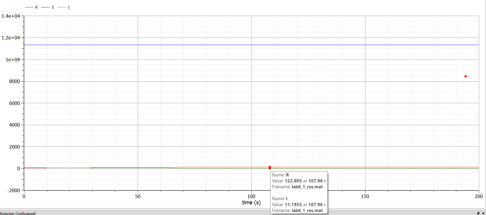
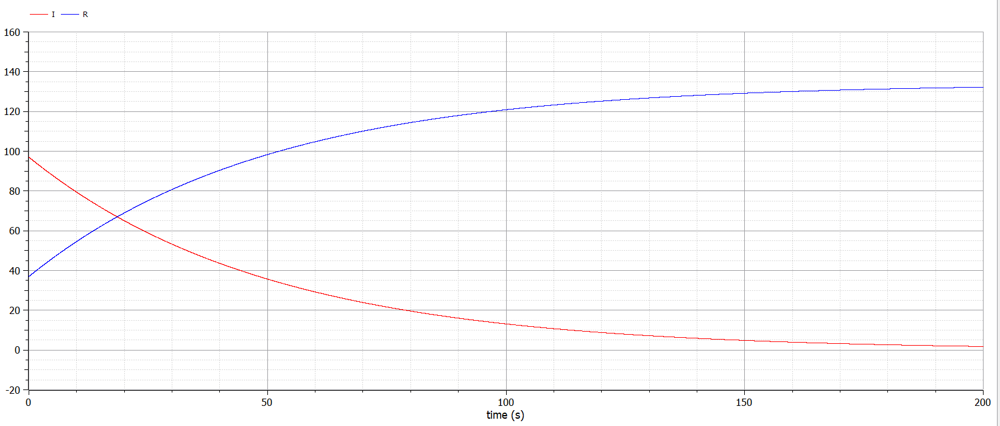
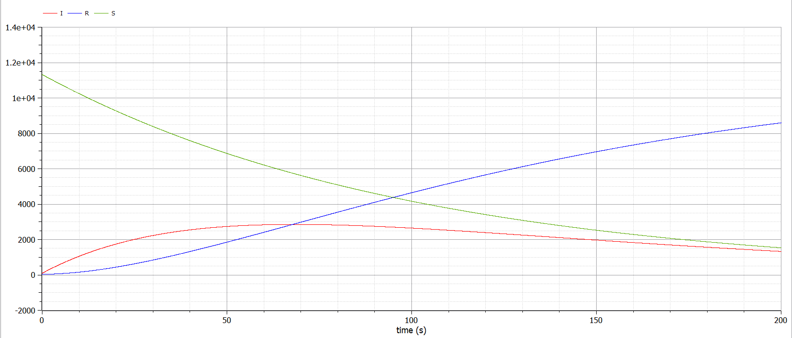

---
## Front matter
lang: ru-RU
title: "Отчет по лабораторной работе 6"
subtitle: "Дисциплина: Математическое моделирование"
author: "Дяченко Злата Константиновна, НФИбд-03-18"

## Formatting
toc: false
slide_level: 2
theme: metropolis
header-includes:
 - \metroset{progressbar=frametitle,sectionpage=progressbar,numbering=fraction}
 - '\makeatletter'
 - '\beamer@ignorenonframefalse'
 - '\makeatother'
aspectratio: 43
section-titles: true

---

## Прагматика выполнения лабораторной работы

 Данная лабораторная работа выполнялась мной для получения знаний в области математического моделирования и решения уравнений модели эпидемии.

## Цель выполнения лабораторной работы

Изучить и построить простейшую математическую модель эпидемии.

## Задачи выполнения лабораторной работы

Число людей, являющихся распространителями инфекции в начале эпидемии $I(0)=97$, число здоровых людей с иммунитетом к болезни $R(0)=37$. Число людей восприимчивых к болезни, но пока здоровых, в начальный момент времени $S(0)=N-I(0)- R(0)$. Построить графики изменения числа особей в каждой из трех групп. Рассмотреть, как будет протекать эпидемия в случае, если  $I(0) \leq I^*$ . (рис. -@fig:001)

## Задачи выполнения лабораторной работы

 {#fig:001 width=80%}

## Задачи выполнения лабораторной работы

 {#fig:002 width=80%}

## Задачи выполнения лабораторной работы

Построить графики изменения изменения числа особей в каждой из трех групп, если если $I(0) > I^*$  (рис. -@fig:003)

{#fig:003 width=70%}

## Результаты выполнения лабораторной работы

Результатом выполнения работы стала построенная математическая модель эпидемии, графики динамики изменения числа людей в каждой из трех групп для двух случаев, которые отражают проделанную мной работу и полученные новые знания.
